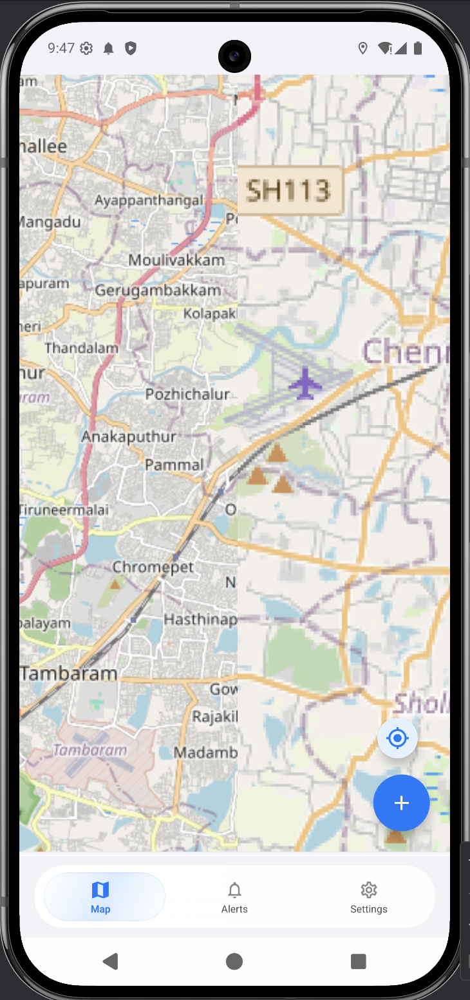
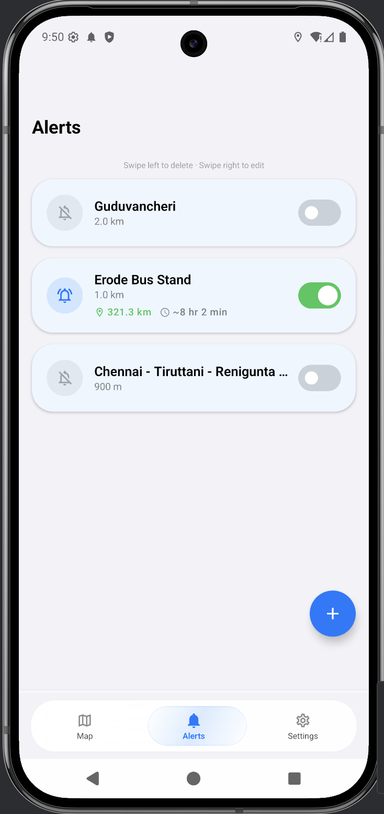
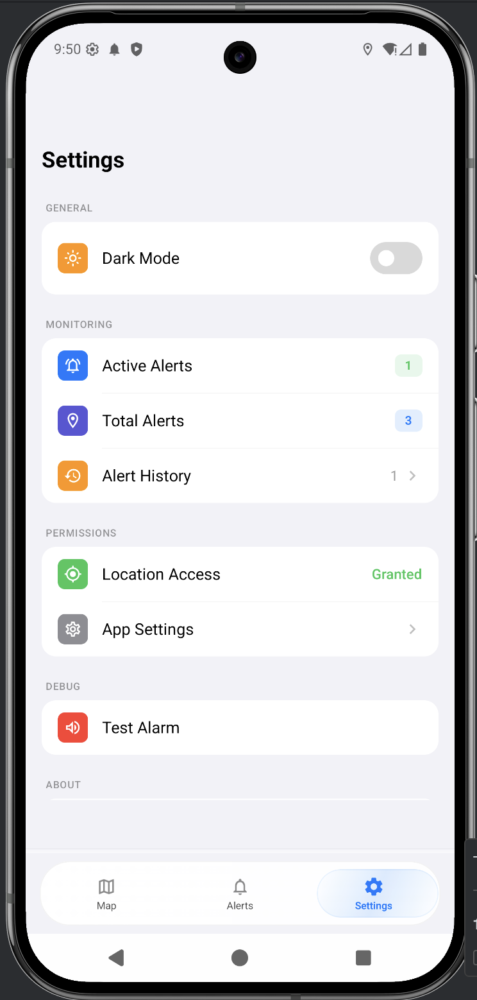

# AlertSpot — Location-Based Alarm App for Android

**AlertSpot** is a free, open-source Android app that wakes you up with a loud alarm when you reach your destination. Set a GPS geofence on any location, and AlertSpot will automatically trigger an alarm — with sound, vibration, and a full-screen notification — so you never miss your stop again.

Perfect for **commuters falling asleep on the bus or train**, travelers on long road trips, or anyone who needs a reliable "wake me up when I get there" alert.

## Why AlertSpot?

- **No Google Maps API key required** — Uses OpenStreetMap (OSMDroid), fully free with no usage limits
- **Works offline** — Map tiles are cached (up to 600 MB) for offline use
- **Dual detection** — Android Geofencing API + timer-based distance checks ensure you never miss an alert
- **Battery smart** — Dynamic GPS polling adjusts frequency based on how close you are to your destination
- **Survives reboots** — Geofences are automatically re-registered after device restart
- **Privacy first** — All data stays on your device, no accounts or cloud services

## Features

- **Geofence Alerts** — Add, edit, delete, and toggle location-based alerts with configurable radius (meters or km)
- **Live Map** — OpenStreetMap view with geofence circles, markers, and real-time distance badges
- **Smart Monitoring** — GPS accuracy and polling frequency adapt automatically (far → near → approaching)
- **Alarm System** — Looping audio, vibration, high-priority notification, and full-screen alarm overlay that wakes your screen
- **Location Search** — Search any address or place name to quickly set up an alert
- **Alert History** — Auto-logged when alarms fire, grouped by day, with delete and clear actions
- **Live Distance & ETA** — Shown on active alerts in the list and on map markers
- **iOS-Style Swipe Actions** — Smooth two-step swipe gestures on alert rows (swipe to reveal, swipe again or tap to act)
- **Settings** — Dark mode toggle, permission status, monitoring stats, test alarm, and version info

## Screenshots

<p align="center">
  
  &nbsp;&nbsp;
  
  &nbsp;&nbsp;
  
</p>

## Getting Started

### Prerequisites

- Android Studio (latest stable)
- Android device or emulator running **Android 8.0+ (API 26)**

### Build & Run

1. Clone the repository:
   ```bash
   git clone https://github.com/your-username/alert-spot-android.git
   ```
2. Open the project in Android Studio
3. Sync Gradle and run on your device or emulator

> **No API keys needed.** AlertSpot uses OpenStreetMap via OSMDroid, which is completely free and requires no setup.

### Permissions

AlertSpot requires the following permissions to function:

| Permission | Why |
|---|---|
| Fine & Coarse Location | Track your position relative to geofences |
| Background Location | Continue monitoring when the app is in the background |
| Foreground Service | Keep location tracking alive via a persistent notification |
| Notifications | Show alarm alerts and monitoring status |
| Wake Lock | Wake the screen when an alarm fires |
| Full-Screen Intent | Display alarm overlay on the lock screen |
| Vibrate | Vibration feedback when alarm triggers |
| Boot Completed | Re-register geofences after device restart |

## Tech Stack

| Layer | Technology |
|---|---|
| Language | Kotlin |
| UI | Jetpack Compose + Material Design 3 |
| Architecture | MVVM with ViewModel + StateFlow |
| Maps | OSMDroid (OpenStreetMap) |
| Location | Google Play Services (FusedLocationProvider + GeofencingClient) |
| Navigation | Jetpack Navigation Compose |
| Serialization | Gson |
| Min SDK | 26 (Android 8.0) |
| Target SDK | 35 |

## How It Works

1. **Add a location** — Search or long-press on the map to drop a pin, set a radius
2. **AlertSpot monitors** — A foreground service tracks your position with adaptive polling
3. **You arrive** — When you enter the geofence radius, a loud alarm fires with sound + vibration + full-screen notification
4. **Dismiss** — Tap the notification or the full-screen overlay to stop the alarm

## License

This project is licensed under the MIT License — see the [LICENSE](LICENSE) file for details.
